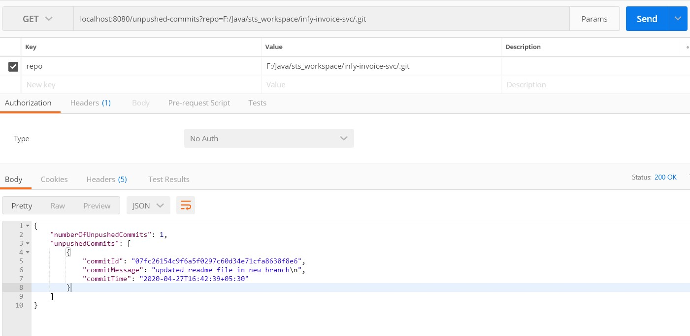

# unpushed-commit-tracker

This is a sample spring-boot project which works on your current branch and has 2 separate services in it known as
<ol> 
  <li>get-unpushed-commits</li>
  <li>get-unpushed-files</li>
</ol>

### unpushed-commits-request

### unpushed-files-request

